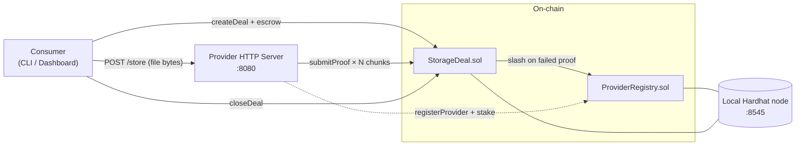
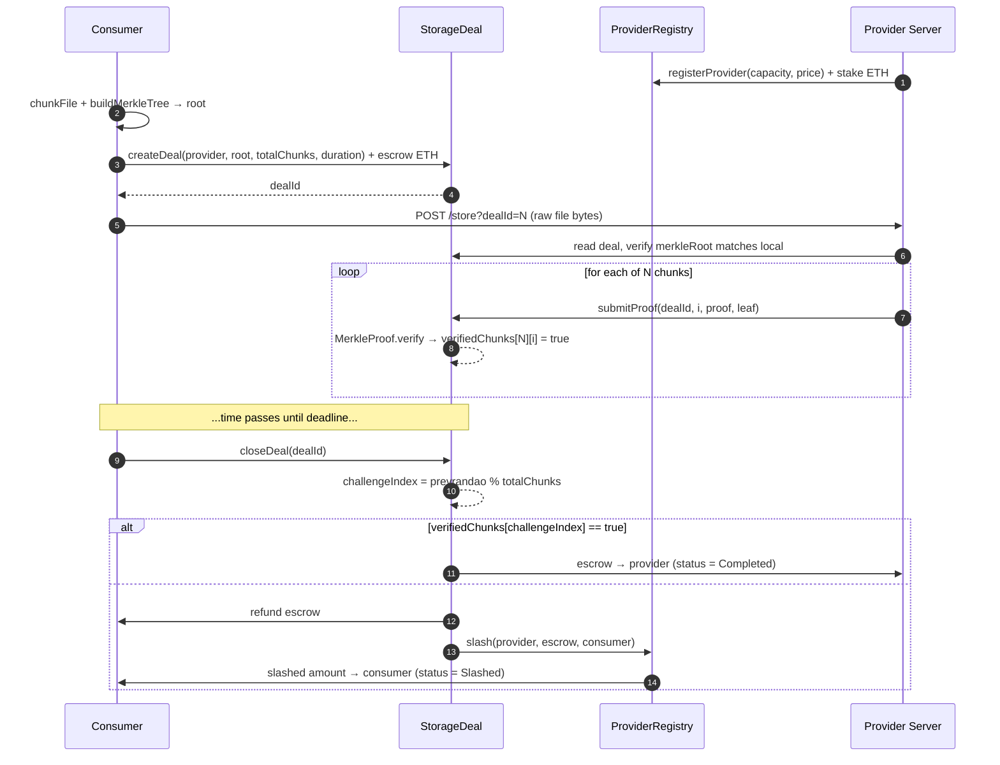

# DePIN-Style Storage Marketplace

> University blockchain course project — COM4532 *Blockchain Technology and Public Ledgers*, Group 19 (3 members).

A decentralized peer-to-peer **storage marketplace**: anyone can rent out unused disk space for ETH, and the smart contract releases payment only after the provider submits a valid Merkle proof-of-storage. Failed proofs slash the provider's stake.

| | |
|---|---|
| **Tests** | 47 / 47 passing |
| **Line coverage** | 100% |
| **Gas / deal lifecycle** | ~390 K (target: ≤ 500 K) |
| **Stack** | Solidity 0.8.28, Hardhat 2 + TypeScript, OpenZeppelin 5, ethers v6, Node 24 |

---

## What's in the box

```
depin-storage-platform/
├── contracts/                    # Solidity sources
│   ├── ProviderRegistry.sol      # provider directory + stake + slash
│   └── StorageDeal.sol           # escrow + Merkle challenge + settlement
├── test/                         # Mocha + Chai + ethers v6 (47 tests, 100% lines)
├── agents/                       # off-chain processes
│   ├── lib/                      # shared Merkle tree + chunking
│   ├── provider/server.ts        # HTTP file store + on-chain proof submitter
│   └── consumer/cli.ts           # create / close / inspect commands
├── dashboard/                    # vanilla HTML + ethers.js dashboard
├── ignition/modules/DePIN.ts     # one-shot deploy + wire
├── scripts/
│   ├── dev.ts                    # one-command local stack for the dashboard
│   └── demo-e2e.ts               # fully scripted end-to-end demo
├── hardhat.config.ts             # 0.8.28 + optimizer + Sepolia stub
└── CLAUDE.md                     # project context for future Claude Code sessions
```

---

## Quick start

```powershell
git clone https://github.com/Alpkrsn/depin-storage-platform.git
cd depin-storage-platform
npm install

# Run the test suite (47 cases, ~4 seconds)
npm test

# Generate the coverage report (100% lines)
npm run coverage
```

### Try it in a browser

```powershell
# Terminal A — start a local blockchain
npm run node

# Terminal B — deploy contracts + start provider + serve dashboard
npm run dev

# Then open http://localhost:3000 in your browser and click "Run Demo Deal".
```

### One-shot scripted demo (no browser)

```powershell
# Terminal A
npm run node
# Terminal B
npm run demo
```

Prints every step of the lifecycle (deploy → register → upload → 6 proofs → time-warp → close → file retrieval).

---

## How the protocol works

### Architecture



### A deal, end to end



### Threat model in one paragraph

The consumer cannot lie about which file was uploaded — the provider verifies the Merkle root on `/store` against the on-chain deal and rejects mismatched uploads. The provider cannot pretend to store data — the proof in `submitProof` only verifies if the leaf hash matches the corresponding position in the committed Merkle tree, which is only possible if the provider actually has that chunk's bytes. Settlement is forced after the deadline by *anyone* calling `closeDeal`, so neither party can stall.

---

## Scope refinements (vs. original proposal)

The original proposal described a broader system; we deliberately narrowed it for a realistic 3-4 week prototype:

| Original | Prototype | Rationale |
|---|---|---|
| Storage **and** CPU/GPU compute | Storage only | Computation proofs require zk-SNARK / TEE / fraud-proof games — open research, weeks of work per circuit, and SNARK verify alone is ~250 K gas (half the NFR2 budget). |
| Custom RST ERC-20 payment token | Plain ETH | Removes one contract and a treasury workflow with no protocol benefit. |
| Periodic proofs-of-storage | One challenge per deal at close | A single `prevrandao`-derived challenge is enough to demonstrate the mechanism. Periodic proofs add no novel logic. |
| Governance contract for params | Hardcoded params | No on-chain voting fits in the timeline. |
| libp2p file transfer | HTTP file transfer | Same protocol semantics, far less infrastructure. |

---

## Known limitations (future work)

1. **Challenge predictability.** `block.prevrandao` is known one block in advance, so a malicious provider colluding with a miner could choose which deals to close when the random index favours them. *Mitigation:* Chainlink VRF (or any commit-reveal scheme).
2. **All-chunks attestation.** A provider can defeat the single-challenge model by submitting `submitProof` for every chunk in advance. Gas is the only deterrent. *Mitigation:* require proofs only **after** the challenge index is revealed (challenge → respond → settle, three-step lifecycle).
3. **Push-payment refund.** `closeDeal` uses `.call{value: x}("")` push transfers. A consumer contract that reverts on receive can stall settlement. *Mitigation:* pull-payment pattern (consumer calls `withdraw` later).
4. **Unbounded provider list.** `getActiveProviders` is O(n) over all registered providers. Fine at prototype scale. *Mitigation:* paginated index for production.
5. **No file durability guarantee between proofs.** A provider could delete and re-fetch from the consumer just-in-time. *Mitigation:* random-access challenges over long intervals + minimum-uptime requirements.

---

## Testing & metrics

```powershell
npm test              # 47 cases across 4 files
npm run coverage      # solidity-coverage report

# Gas table (with optimizer runs=200)
$env:REPORT_GAS="true"; npm test
```

Key gas numbers (worst-case, hardhat in-memory network):

| Operation | Gas |
|---|---|
| `registerProvider` (first time) | 159,679 |
| `createDeal` | 130,421 |
| `submitProof` (per chunk) | 55,042 |
| `closeDeal` (success) | 45,304 |
| `closeDeal` (slash) | 67,396 |
| **Total deal lifecycle (1-chunk submit)** | **~390 K** |

Coverage:

| File | Statements | Branches | Functions | Lines |
|---|---|---|---|---|
| ProviderRegistry.sol | 97.56 % | 85.71 % | 100 % | **100 %** |
| StorageDeal.sol | 100 % | 85.29 % | 100 % | **100 %** |

---

## Team

- COM4532 Group 19 (3 members)
- Source: <https://github.com/Alpkrsn/depin-storage-platform>

## License

MIT
